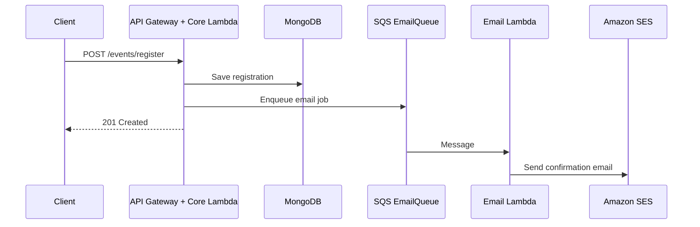

# CodeWave — Events Platform (Project Spec)

This document describes what we are building, how the pieces fit together, and a practical build order for the **backend** (`backend/`) and **frontend** (`frontend/`) in this repository.

---

## What we are building

An **event management** product where:

- **Identity** lives in **AWS Cognito** (signup, login, JWTs for protected APIs).
- **Core business behavior** is **event-driven**: registrations are written to the database quickly, while **email side effects** run **asynchronously** via **SQS → Lambda**, so the API stays responsive.

The MVP covers authenticated users, event CRUD (including banner images on S3), registration with queued confirmation email, and **daily reminders** for events starting within 24 hours.

---

## Repository layout

| Path | Role |
|------|------|
| `backend/` | Serverless Framework app: API Gateway, Lambdas, SQS, Cognito integration, EventBridge, SES, S3 (IaC + handlers). |
| `frontend/` | Next.js (React) app: UI and calls to the backend API. |
| `project-spec.md` | This specification (source of truth for scope and architecture). |

---

## Technical stack

| Layer | Choice |
|--------|--------|
| **IaC** | [Serverless Framework](https://www.serverless.com/) (`serverless.yml`) |
| **API & compute** | Node.js on **AWS Lambda** behind **API Gateway** |
| **Database** | **MongoDB Atlas** with **Mongoose** |
| **Auth** | **AWS Cognito** (JWT on private routes) |
| **Async messaging** | **Amazon SQS** |
| **Email** | **Amazon SES** |
| **Media** | **S3** (+ **CloudFront** for delivery) |
| **Frontend** | **Next.js** (React) |

---

## Backend architecture (two tracks)

We split traffic into a **synchronous user track** and an **asynchronous core track** for registrations and notifications.

### A. User track (synchronous)

**Purpose:** Account lifecycle and profile data aligned with Cognito.

**Flow:** `POST /auth/signup` → **User Lambda** → Cognito + MongoDB (profile / app-specific user record).

**Notes:** Prefer Cognito’s built-in flows (e.g. verification email via Cognito) where possible.

### B. Core track (async / decoupled)

**Purpose:** Event registration and “ticket” processing without blocking the client on email.

**API flow**

1. Client calls `POST /events/register`.
2. **Core Lambda** validates the request and **persists the registration** in MongoDB.
3. Core Lambda **enqueues a message** to **EmailQueue** (payload includes e.g. user email and event details).
4. API returns **201** immediately.

**Worker flow**

1. **Email Lambda** is triggered by messages on **EmailQueue**.
2. Lambda sends the **confirmation email** via **SES**.

---

## MVP feature scope

1. **Auth** — Login / signup with Cognito; **JWT** required on all private routes.
2. **Events** — CRUD for events: title, description, date, **banner image** stored in S3.
3. **Registration** — Registration flow that **writes to DB** then **buffers email work in SQS** (pattern above).
4. **Scheduled reminders** — **EventBridge** (cron, e.g. daily) invoking a **dailyReminder** Lambda that finds events occurring within the next **24 hours** and triggers reminder sends (implementation detail: direct SES, or enqueue to SQS for consistency).

---

## Security practices (non-negotiable for production)

- Store **MongoDB URI** in **AWS Secrets Manager** (not only plain `.env` in deployed environments).
- **S3 presigned URLs** for uploads so buckets are not publicly writable.
- **CloudFront** with **OAI / OAC** so private bucket objects are served only through your distribution.

---

## Implementation roadmap (for incremental delivery)

Use these as Cursor-sized milestones; adjust naming to match your actual `serverless.yml` resources.

1. **Infrastructure** — Initialize Serverless in `backend/`: `EmailQueue` SQS, S3 bucket for media, env/Secrets wiring for Atlas, IAM least-privilege for Lambdas.
2. **Data & auth** — Mongoose models for **Event** and **Registration**; Cognito User Pool; Lambda (or trigger) path to create/update **MongoDB user profile** after signup.
3. **Registration + email** — `registerEvent` Lambda: DB write + **AWS SDK v3** `SendMessage` to EmailQueue; `processEmail` Lambda: SQS event source → **SES** send.
4. **Scheduling** — EventBridge rule in `serverless.yml` (e.g. every 24 hours) → `dailyReminder` Lambda.
5. **Frontend** — Wire Next.js to API Gateway: auth headers, event admin UI, registration UX, image upload via presigned URL flow.

---

## Naming note

The product was previously referred to as “CloudWave” in an early draft; this repo and spec use **CodeWave** for consistency with the project folder name.
